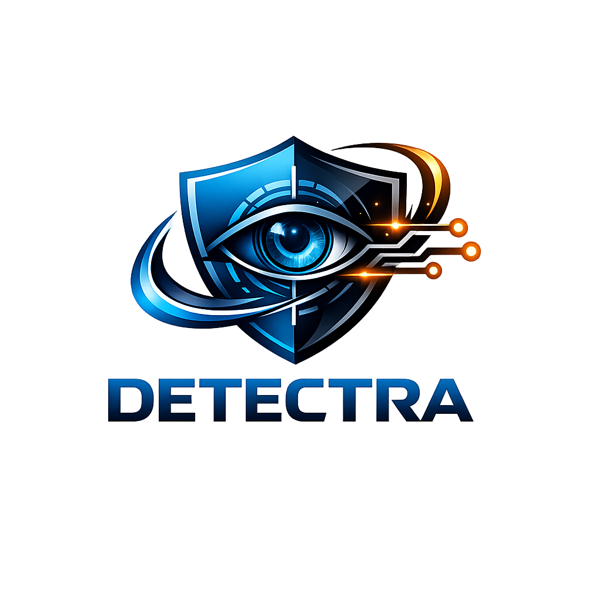
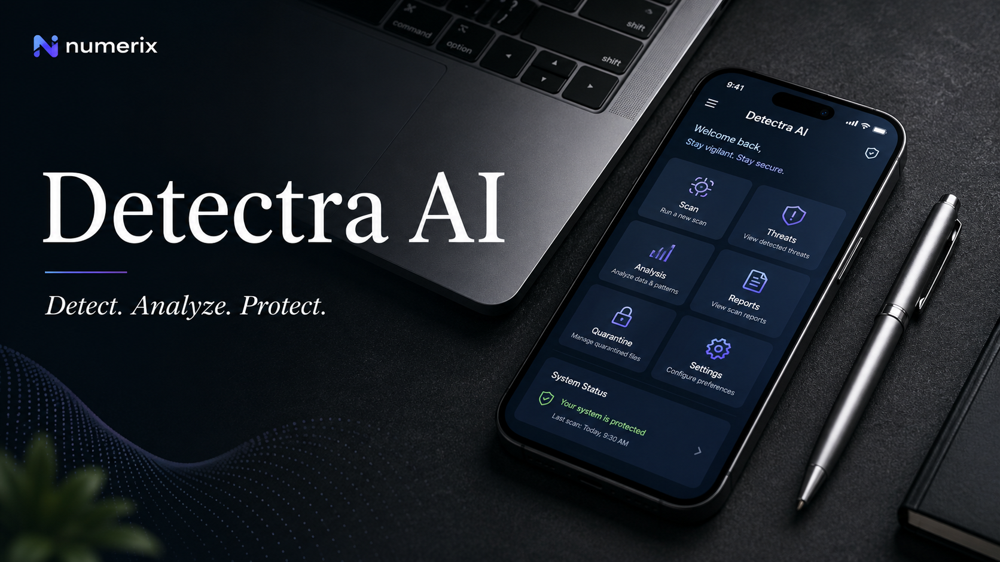

<p align="center">
  
</p>

<div align="center">

# 🛡️ *Detectra AI*

# (AI-Powered Digital Public Safety Platform)

### "Detect. Analyze. Protect."

🌐 **Live Project:** https://detectra-ai.lovable.app/




</div>

> **Detectra AI** is an AI-powered cybersecurity and public safety platform designed to help citizens identify cyber fraud, digital arrest scams, suspicious communications, and counterfeit currency before financial loss occurs. By combining Generative AI, OCR, image analysis, and fraud intelligence, Detectra AI empowers users to make safer decisions in an increasingly digital world.

---

# 🧠 Problem Statement

Cybercrime is evolving rapidly across India through:

* Digital Arrest Scams
* UPI Frauds
* KYC Verification Scams
* Job Recruitment Scams
* Investment Frauds
* Lottery Scams
* Counterfeit Currency Circulation

Most victims recognize these threats only after suffering financial losses.

Citizens often lack access to simple, reliable, and intelligent tools that can help them identify fraudulent activity in real time.

---

# 💡 Our Solution — Detectra AI

**Detectra AI provides an intelligent fraud detection ecosystem that helps users identify threats before they become victims.**

Using AI-powered analysis, image recognition, OCR processing, and risk assessment, the platform enables citizens to:

* Detect scam messages instantly
* Analyze suspicious screenshots
* Verify currency authenticity
* Generate fraud intelligence reports
* Access cybercrime reporting resources
* Make informed decisions before financial loss occurs

📌 **Prevention is better than recovery. Detectra AI focuses on stopping fraud before damage happens.**

---

# 🌟 Key Features

## 🔍 Scam Message Analyzer

Analyze suspicious:

* SMS Messages
* WhatsApp Messages
* Telegram Messages
* Emails

### AI Output

* Risk Score
* Fraud Category
* Severity Level
* Red Flags
* Detailed Explanation
* Safety Recommendations

---

## 📷 Screenshot Fraud Scanner

Upload screenshots from:

* WhatsApp
* SMS
* Telegram
* Email

The system:

* Extracts text using OCR
* Detects fraud indicators
* Generates risk assessment
* Provides actionable recommendations

---

## 💵 Fake Currency Detection

Upload images of Indian currency notes.

Detectra AI analyzes:

* Security Threads
* Watermarks
* RBI Markings
* Print Consistency
* Counterfeit Indicators

### Supported Notes

* ₹100
* ₹200
* ₹500
* ₹2000

### Output

* Authenticity Score
* Confidence Level
* Suspicious Indicators
* Currency Analysis Report

---

## 📊 Fraud Intelligence Dashboard

Interactive dashboard providing:

* Fraud Category Distribution
* Risk Analytics
* Monthly Fraud Trends
* Counterfeit Detection Statistics
* Citizen Safety Insights

---

## 🗺️ India Fraud Heatmap

Visual representation of fraud hotspots across India.

Features:

* City-wise Incident Analysis
* Fraud Distribution Visualization
* Risk Mapping
* Financial Loss Estimation

---

## 📄 AI Report Generator

Generate downloadable reports containing:

* Fraud Summary
* Risk Assessment
* Detected Threats
* Recommended Actions
* Citizen Guidance

---

## 🚨 Cyber Crime Reporting Integration

Direct access to:

* National Cyber Crime Reporting Portal
* Cybercrime Helpline (1930)

Helping citizens report incidents quickly and efficiently.

---

# 🚀 Core Capabilities

* AI-powered fraud detection
* Counterfeit currency analysis
* OCR-based screenshot scanning
* Real-time risk assessment
* Interactive fraud intelligence dashboard
* Cybercrime reporting assistance
* Responsive multi-device experience

---

# 🧰 Tech Stack

## 🔹 Frontend

* React.js
* TypeScript
* Tailwind CSS
* Shadcn UI
* React Router

## 🔹 AI & Processing

* Google Gemini API
* OCR Processing
* Image Analysis
* Fraud Classification Engine

## 🔹 Data Visualization

* Recharts
* Interactive Maps
* Analytics Dashboard

## 🔹 Deployment

* Lovable

---

# 🚀 Launch & Live Experience

Detectra AI is designed as a cloud-native platform focused on accessibility, performance, and usability.

### Features Include

* ⚡ Fast Performance
* 🔒 Secure Architecture
* 📱 Fully Responsive Design
* 🌎 Accessible Anywhere
* 🚀 Modern User Experience

---

# 📊 Use Cases

### 👨‍👩‍👧‍👦 Citizens

* Verify suspicious messages
* Detect scams before financial loss
* Analyze suspicious screenshots

### 🏦 Financial Institutions

* Fraud awareness initiatives
* Customer protection programs

### 🏛️ Government Agencies

* Digital safety campaigns
* Public awareness programs

### 👮 Law Enforcement

* Fraud intelligence support
* Incident analysis

---

# 🏗️ System Architecture

```text
Citizen
   │
   ▼
Detectra AI Platform
   │
   ├── Scam Analyzer
   ├── Screenshot Scanner
   ├── Currency Detector
   ├── Dashboard
   └── Report Generator
            │
            ▼
       Gemini AI
            │
            ▼
     Risk Assessment
            │
            ▼
      AI Recommendations
```

---

# 🔮 Future Roadmap

* Voice Scam Detection
* Deepfake Detection
* WhatsApp Integration
* Banking API Integration
* Telecom Intelligence Integration
* Fraud Prediction Models
* Real-Time Threat Monitoring
* Law Enforcement Dashboard

---

# 👥 Team Code Busters

| Member                   | Role                             |
| ------------------------ | -------------------------------- |
| **P.S.L. Sampath Kumar** | Team Lead & Full Stack Developer |
| **Harshitha Panchabavi** | Documentation Lead               |
| **Chandana Palamanda**   | Research Lead                    |

---

# 🤝 Connect With Us

| Name                 | LinkedIn                                                                |
| -------------------- | ----------------------------------------------------------------------- |
| P.S.L. Sampath Kumar | https://www.linkedin.com/in/sri-lakshmi-sampath-kumar-pachala-1b8813369 |
| Harshitha Panchabavi | https://www.linkedin.com/in/sree-harshitha-panchabavi-50a942360/                                                        |
| Chandana Palamanda   | https://www.linkedin.com/in/chandana-palamanda-a16675360/                         |

---

# ⭐ Support

If you find Detectra AI useful, consider:

⭐ Starring this repository

🍴 Forking the project

🛡️ Promoting cyber safety awareness

📢 Sharing the project with others

For support, suggestions, or collaboration:

📧 Contact the Team Code Busters members through LinkedIn.

---

# 📜 Disclaimer

Detectra AI is a hackathon prototype developed for educational and demonstration purposes.

The platform assists users in identifying potential fraud and counterfeit currency indicators but should not replace official investigations, banking verification procedures, or law enforcement decisions.

---

# 🇮🇳 Citizen Safety First

If you encounter cyber fraud:

📞 **Cybercrime Helpline:** 1930

🌐 **National Cyber Crime Reporting Portal:** https://cybercrime.gov.in

---

# 🧑‍💻 Developed By

## Team Code Busters

*"Using AI to build a safer digital future."*

---

<div align="center">

## 🛡️ Detect. Analyze. Protect.

### Building a Safer Digital India with AI 🇮🇳

Made with ❤️ by Team Code Busters

</div>
